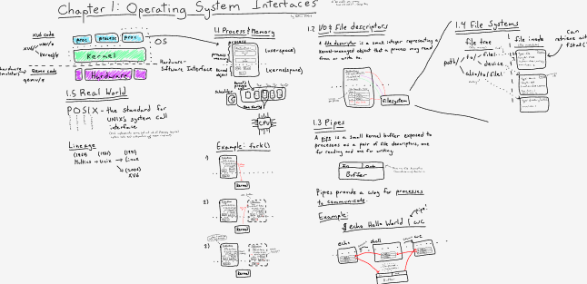

This repository is intended to be a collection of reference diagrams/comics. I find the act of spacially laying out and connecting diagrams useful in understanding and remembering them. They're also fun :)

xv6 OS:
**Chapter 1**

## References
Some of the comics I'm inspired by include:

Julia Evans (https://wizardzines.com/comics/syscalls/)

Ange Albertini (https://github.com/corkami/pics/blob/28cb0226093ed57b348723bc473cea0162dad366/binary/elf101/elf101-64.svg)

Lexi Mattick (https://cpu.land/)

The Visual Display of Quantitative Information

